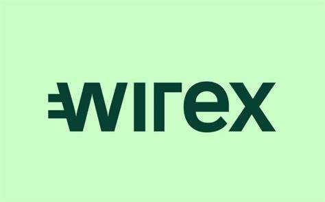

## **WX_EWS**

## Setup WX_EWS

|Action|Command
| :-| :-
|Create a virtual environment| python -m venv .venv
|Install relevant libraries | pip install -r requirements.txt|
|Create a .env file and add it to the root | .env
|Create json launch file| Open and Paste contents of launch_items.txt (ensure commas are correct)|
|Run Make Migrations|Run & debug -> dropdown Menu -> Make Migrations |
|If  No Migration Changes |Ensure migrations folder with blank __init__.py file in |
|Run Migrations|Run & debug -> dropdown menu -> Migrate|
|Populate Tables|Run & debug -> dropdown menu -> Populate Tables|

## Enviroment Variables

|Environment variable|value|
| :-| :-
|PEG_DEVIATION_ALERT|1
|ORDERBOOKS_REFRESH_INCREMENT_MINS|1
|DEFI_LLAMA_STABLECOIN_REFRESH_INCREMENT|5
|TIMEOUT|10
|UPDATE_REFRESH_INCREMENT_MINS|10
|MANAGER_REFRESH_INCREMENT_MINS|15
|RELEVENT_NEWS_LOOKBACK_DAYS|30
|OKX_ARTICLE_BASE_URL|=https://www.okx.com/help-center/
|OKX_NEWS_DICT_URL|=https://www.okx.com/v2/support/home/web
|OKX_ORDERBOOK_URL|=https://www.okx.com/api/v5/market/tickers?instType=SPOT
|OKX_DELIST_URL|=https://www.okx.com/api/v5/public/instruments?instType=SPOT
|BINANCE_ORDERBOOK_URL|=https://api.binance.com/api/v3/ticker/bookTicker
|BINANCE_ARTICLE_BASE_UR|L=https://www.binance.com/en/support/announcement/
|BINANCE_DELIST_URL|=https://www.binance.com/bapi/asset/v2/public/asset-service/product/get-products?includeEtf=true
|BINANCE_NEWS_DICT_URL|=https://www.binance.com/bapi/composite/v1/public/cms/article/list/query?type=1&pageSize=20&pageNo=1
|DEFI_LLAMA_BASE_URL|https://defillama.com/
|DEFI_LLAMA_HACKS_URL|https://defillama.com/hacks
|DEFI_LLAMA_BRIDGE_HACKS|https://defillama.com/_next/data/3b1dcc58094f2a2d31f11f4ea026016f4b4b8391/hacks.json
|DEFI_LLAMA_STABLECOIN_URL|https://defillama.com/_next/data/3b1dcc58094f2a2d31f11f4ea026016f4b4b8391/stablecoins.json
|CEX_WEBHOOK_URL| *Insert CEX Teams Webhook*
|DEFI_WEBHOOK_URL| *Insert Defi Teams Webhook*
|STABLECOIN_WEBHOOK_URL| *Insert Stablecoin Teams Webhook*
|STABLECOINS|insert stablecoins which should require notifications
|SPOT_CURRENCIES| insert spot currencies which should require notifications
|USDM_CURRENCIES| insert Binance USDM currencies which should require notifications

## Executive Summary

This repository offers a comprehensive infrastructure designed to monitor announcements from **Binance**, one of the world's leading cryptocurrency exchanges, based on classified keywords. Notably, its capabilities have recently been expanded to encompass an even broader range of event monitoring.

## Binance Workflow:
1. The process initiates by pulling data from the `BINANCE_NEWS_DICT_URL`, gathering a detailed list of all recent Binance announcements.
2. Using **Regular Expressions (Regex)**, it performs keyword classification based on the specified terms in the `EnumLowAlertWarningKeyWords` & `EnumHighAlertWarningKeyWords` files, matching against the Title and Summaries of the annoucments. This results in a list of `BinanceRawArticle` objects that contain the matched keywords.
3. As an enhancement, the program retrieves the complete announcement details, parsing the information into a `ModelBinanceEvent`. It further inspects the HTML for specific details such as the affected tickers, affected currencies, event priority, event category, and the trading status of the token during the event. This rigorous scrutiny ensures the pertinence of the announcement to trading activities.
4. Event priority is determined based on the currencies and tickers mentioned in the `SPOT_CURRENCIES` and `USDM CURRENCIES` environment variables, which represent pairs currently listed on Wirex.
5. Finally, the `ModelBinanceEvent` objects are stored in a database. A dedicated consumer manages this database. If the event's important date is earlier than the current timestamp, the consumer checks for unicity before dispatching the `ModelBinanceEvent.ms_teams_message` to the `Webhook_URL`.

## OKX Workflow:
1. The process initiates by pulling data from the `OKX_NEWS_DICT_URL`, gathering a detailed list of all recent OKX announcements.
2. Using **Regular Expressions (Regex)**, it performs keyword classification based on the specified terms in the `EnumLowAlertWarningKeyWords` & `EnumHighAlertWarningKeyWords` files, matching against the Title and Summaries of the annoucments. This results in a list of `OkxRawArticle` objects that contain the matched keywords.
3. As an enhancement, the program retrieves the complete announcement details, parsing the information into a `ModelOkxEvent`. It further inspects the HTML for specific details such as the affected tickers, affected currencies, event priority, event category, and the trading status of the token during the event. This rigorous scrutiny ensures the pertinence of the announcement to trading activities.
4. Event priority is determined based on the currencies and tickers mentioned in the `SPOT_CURRENCIES` and `USDM CURRENCIES` environment variables, which represent pairs currently listed on Wirex.
5. Finally, the `ModelOkxEvent` objects are stored in a database. A dedicated consumer manages this database. If the event's important date is earlier than the current timestamp, the consumer checks for unicity before dispatching the `ModelOkxEvent.ms_teams_message` to the `Webhook_URL`.

## New Enhancements:
  
- **Integration with DeFi Llama:** An important addition is the integration with **DeFi Llama**. This enables the system to:
  - Monitor potential stablecoin de-pegs, a significant event where a stablecoin deviates from its pegged value.
  - Stay alert to DeFi protocol hacks. As the DeFi ecosystem expands, it's become crucial to track potential security breaches in protocols.
  - Watch out for cross-chain bridge hacks. With the proliferation of multi-chain platforms, cross-chain bridges are essential, and any security incident concerning them is of utmost importance.
  
- **Alert System:** The repository is now equipped to send alert notifications through the **Microsoft Teams webhook** specified in the environment variables. This ensures timely and efficient communication of any critical events.

- **Materialized View:** Users benefit from a materialized view that provides an at-a-glance understanding of all ongoing events, ensuring no critical information slips through the cracks.

In sum, this repository has evolved into a holistic monitoring solution, keeping a vigilant eye on the dynamic world of cryptocurrencies and ensuring stakeholders remain informed and prepared.
