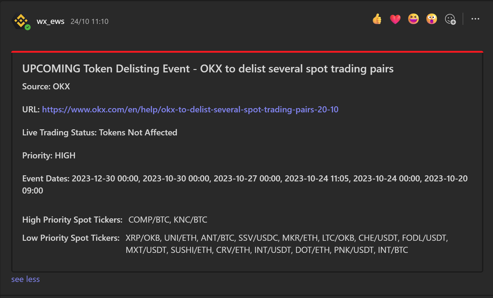
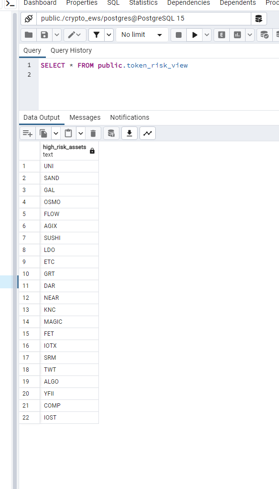

# **CRYPTO_EWS**

## Setup

|Action|Command
| :-| :-
|Create a virtual environment| python -m venv .venv
|Install relevant libraries | pip install -r requirements.txt|
|Create a .env file and add it to the root (check example_env.txt) | .env
|Create json launch file| Open and Paste contents of launch_items.txt (ensure commas are correct)|
|Run Make Migrations|Run & debug -> dropdown Menu -> Make Migrations |
|If  No Migration Changes |Ensure migrations folder with blank __init__.py file in |
|Run Migrations|Run & debug -> dropdown menu -> Migrate|
|Populate Tables|Run & debug -> dropdown menu -> Populate Tables|

## environment Variables

|Environment variable|value|
| :-| :-
|PEG_DEVIATION_ALERT|1
|ORDERBOOKS_REFRESH_INCREMENT_MINS|1
|DEFI_LLAMA_STABLECOIN_REFRESH_INCREMENT|5
|TIMEOUT|10
|UPDATE_REFRESH_INCREMENT_MINS|10
|MANAGER_REFRESH_INCREMENT_MINS|15
|RELEVENT_NEWS_LOOKBACK_DAYS|30
|COINMARKETCAP_REFRESH_INCREMENT|58
|MINIMUM_LIQUIDITY_THRESHOLD|5000
|COINMARKETCAP_BASE_URL|https://coinmarketcap.com/
|COINMARKETCAP_CCY_URL|https://api.coinmarketcap.com/data-api/v3/cryptocurrency/market-pairs/latest?slug=
|OKX_BASE_TRADING_URL|https://www.okx.com/trade-spot/
|OKX_ARTICLE_BASE_URL|https://www.okx.com/help-center/
|OKX_NEWS_DICT_URL|https://www.okx.com/v2/support/home/web
|OKX_ORDERBOOK_URL|https://www.okx.com/api/v5/market/tickers?instType=SPOT
|OKX_DELIST_URL|https://www.okx.com/api/v5/public/instruments?instType=SPOT
|BINANCE_BASE_TRADING_URL|https://www.binance.com/en/trade/
|BINANCE_ORDERBOOK_URL|https://api.binance.com/api/v3/ticker/bookTicker
|BINANCE_ARTICLE_BASE_URL|https://www.binance.com/en/support/announcement/
|BINANCE_DELIST_URL|https://www.binance.com/bapi/asset/v2/public/asset-service/product/get-products?includeEtf=true
|BINANCE_NEWS_DICT_URL|https://www.binance.com/bapi/composite/v1/public/cms/article/list/query?type=1&pageSize=20&pageNo=1
|DEFI_LLAMA_BASE_URL|https://defillama.com/
|DEFI_LLAMA_HACKS_URL|https://defillama.com/hacks
|DEFI_LLAMA_BRIDGE_HACKS|https://defillama.com/_next/data/3b1dcc58094f2a2d31f11f4ea026016f4b4b8391/hacks.json
|DEFI_LLAMA_STABLECOIN_URL|https://defillama.com/_next/data/3b1dcc58094f2a2d31f11f4ea026016f4b4b8391/stablecoins.json
|CEX_WEBHOOK_URL| *Insert CEX Teams Webhook*
|DEFI_WEBHOOK_URL| *Insert Defi Teams Webhook*
|STABLECOIN_WEBHOOK_URL| *Insert Stablecoin Teams Webhook*
|TOKEN_VOLATILITY_WEBHOOK_URL| *Insert Token Volatility Teams Webhook*
|TOKEN_LIQUIDITY_WEBHOOK_URL| *Insert Token Liquidity Teams Webhook*
|STABLECOINS|*Insert stablecoins which should require notifications*
|CURRENCY_NAMES| *Insert dict of Ticker:CoinMarketCap Search name, eg. "DAI:multi-collateral-dai "* 
|SPOT_CURRENCIES| *Insert spot currencies which should require notifications*
|USDM_CURRENCIES| *Insert Binance USDM currencies which should require notifications*
|BASE_CURRENCIES| *Insert base currencies of all tickers, eg. USDT, BTC, BUSD* 

## Disclaimer

This trading research repository was created as a proof of concept and should not be utilized in a trading environment. TThe code in this repository is for educational use and users should verify its suitability for their purposes. The author of this repository does not make any representation or warranty as to the accuracy, completeness, or reliability of the information contained herein. The user should be aware that there are risks associated with trading and that trading decisions should only be made after careful consideration of all relevant factors. The author of this repository will not be held responsible for any losses that may result from the use of this code.

## Executive Summary

This repository provides a market risk monitoring system optimized for cryptocurrency trading, which tracks market events on the Binance and OKX exchanges, as well as in the DeFi space. Its capabilities include tracking a range of market events: hard forks, trading pair delistings, stablecoin depegging, DeFi hacks, token volatility, market liquidity drops, and network migrations.

At its core, the system employs a PostgreSQL database to store retrieved live market events, flagging tokens at 'high alert' if they are affected by an event. Alerts are sent via Microsoft Teams, enabling Trading Operations teams to take prompt action to secure trading exposures and shield their P&L from potential impacts. This system also provides a live materialized view, which can be utilised by live trading infrastructure to adjust params based upon live market events.

In addition to exchange-based announcements, the infrastructure leverages information from DeFi Llama, a recognized platform for tracking decentralized finance (DeFi) metrics. This integration is particularly crucial for the real-time tracking of DeFi and bridge hacks, along with the monitoring of stablecoin peg stability. Recognizing hacks or deviations from the peg in real-time is vital, as it prevents the trading system from executing trades with assets that may have depreciated unexpectedly, preventing potential losses stemming from such events.

Finally, this repository queries the CoinMarketCap API to ensure that all tokens  have a liquid primary market, this again ensures a pragmatic risk managment approach to ensure that market conditions are adequetly monitored. This ensures tokens which have low liquidity are identified and researched, preventing trading systems from executing trades in markets which will incur signifianct slippage. 

The repository's functionality — from risk monitoring to live event tracking — is achieved through code adhering to PEP 8 standards, which ensures readability and maintainability. The codebase is modular, following the principles of interface segregation and the robust use of design patterns along with abstract base class (ABC) logic. This strategic structuring allows for targeted enhancements and adaptations without the need for widespread changes, making the system both scalable and efficient.

## Binance Workflow:
1. The process initiates by pulling data from the `BINANCE_NEWS_DICT_URL`, gathering a detailed list of all recent Binance announcements.
2. Using **Regular Expressions (Regex)**, it performs keyword classification based on the specified terms in the `EnumLowAlertWarningKeyWords` & `EnumHighAlertWarningKeyWords` files, matching against the Title and Summaries of the announcements. This results in a list of `BinanceRawArticle` objects that contain the matched keywords.
3. As an enhancement, the program retrieves the complete announcement details, parsing the information into a `ModelBinanceEvent`. It further inspects the HTML for specific details such as the affected tickers, affected currencies, event priority, event category, and the trading status of the token during the event. This scrutiny ensures announcements are relevant to trading activities.
4. Event priority is determined based on the currencies and tickers mentioned in the `SPOT_CURRENCIES` and `USDM CURRENCIES` environment variables, which represent pairs currently listed in the environment.
5. Finally, the `ModelBinanceEvent` objects are stored in a database. A dedicated consumer manages this database. If the event's important date is earlier than the current timestamp, the consumer checks for unicity before dispatching the `ModelBinanceEvent.ms_teams_message` to the `Webhook_URL`.
6. Request and update are completed every `UPDATE_REFRESH_INCREMENT_MINS` and Db management is done every `MANAGER_REFRESH_INCREMENT_MINS`.

## OKX Workflow:
1. The process initiates by pulling data from the `OKX_NEWS_DICT_URL`, gathering a detailed list of all recent OKX announcements.
2. Using **Regular Expressions (Regex)**, it performs keyword classification based on the specified terms in the `EnumLowAlertWarningKeyWords` & `EnumHighAlertWarningKeyWords` files, matching against the Title and Summaries of the announcements. This results in a list of `OkxRawArticle` objects that contain the matched keywords.
3. As an enhancement, the program retrieves the complete announcement details, parsing the information into a `ModelOkxEvent`. It further inspects the HTML for specific details such as the affected tickers, affected currencies, event priority, event category, and the trading status of the token during the event. This scrutiny ensures announcements are relevant to trading activities.
4. Event priority is determined based on the currencies and tickers mentioned in the `SPOT_CURRENCIES` and `USDM CURRENCIES` environment variables, which represent pairs currently listed in the environment.
5. Finally, the `ModelOkxEvent` objects are stored in a database. A dedicated consumer manages this database. If the event's important date is earlier than the current timestamp, the consumer checks for unicity before dispatching the `ModelOkxEvent.ms_teams_message` to the `Webhook_URL`.
6. Request and update are completed every `UPDATE_REFRESH_INCREMENT_MINS` and Db management is done every `MANAGER_REFRESH_INCREMENT_MINS`.

## DeFiLlama Workflow:
1. The process initiates by sending a request to the DeFi Llama website `DEFI_LLAMA_BASE_URL`, extracting a unique hash from the HTML script tags to create a new API request URL, thus evading the standard rate limiting.
2. It employs web scraping and open API endpoints to collect information on stablecoin depegging and hacking events for further analysis.
3. Collected data is then processed into a `ModelEvent` structure. Hack events are uniquely identified by title and ID for reporting, while stablecoin depegs are tracked over an extended period for continuous reporting. These incidents are classified as high priority with affected network tokens identified by the hack or the base token of the compromised network.
4. The processed events are encapsulated as alerts in `ModelEvent` objects, which are then either updated or newly created in the system based on their uniqueness and relevance.
5. The system sends out alerts and maintains the `ModelEvent` records in a database, managed by a specialized process that ensures data integrity and relevance.
6. The entire process for data retrieval, updates, and database management is executed at predefined intervals specified by `DEFI_LLAMA_STABLECOIN_REFRESH_INCREMENT` and `DEFI_LLAMA_UPDATE_REFRESH_INCREMENT_MINS` environment variables, ensuring timely and efficient data handling.

## Token Volatility Risk View:
1. The process initiates by pulling orderbook data from Binance and OKX, targeting pairs listed under `SPOT_CURRENCIES` and `USDM CURRENCIES` from environment variables, with Binance data taking precedence and OKX as secondary.
2. An observer is linked to the store_token_price_change cache, structured as a dictionary with update increments as keys. It flags pair updates when their price shifts surpass set increment levels.
3. Update increments (1, 5, 15, 30, 60 minutes, 3, 6, 12, and 24 hours) `EnumOrderbookUpdatedIncrement` are determined for the current cycle. The cache is updated accordingly, and the observer is alerted if the price update exceeds the defined threshold in `EnumWarningPriceChange`
4. Once notified, the observer creates a `ModelTokenVolatilityEvent`. If it’s a new event, it's saved; if a matching event exists, tickers are rolled forward to the new event to reflect the latest high-priority status for 24 hours post-volatility event.
5. trading operations teams can receive notifications about these volatility events through team messaging, and the materialized view is updated to show the new data.
6. This data retrieval and update cycle, including database updates, runs at regular intervals as set by the `ORDERBOOKS_REFRESH_INCREMENT_MINS` environment variable, ensuring data is managed promptly and efficiently.

## CoinMarketCap:
1. The process begins by iterating through the `CURRENCY_NAMES` dictionary from the environment variables. During each iteration, the script fetches the most liquid market for a cryptocurrency as listed on CoinMarketCap and compares its liquidity to the `MINIMUM_LIQUIDITY_THRESHOLD`.
2. If the liquidity of a token falls below this threshold, the token is added to a list. This list is then used to query the database for any corresponding events. If there is no existing event, a new one is created. If there is an existing event with fewer than 10 important dates, a new important_date is appended to it. However, if there are already 10 important dates, the existing `ModelLiquidityEvent` is marked as closed, and a new event is then initiated.
3. The cycle of data retrieval and database updates is performed at regular intervals, determined by the `COINMARKETCAP_REFRESH_INCREMENT` environment variable. This ensures timely and efficient management of the data.

## Design Choices 

### Django 
In the construction of this repository, I consciously chose Django and its ORM for the system architecture. The decisive factor was Django models' inherent rigor in data typing and structure. By predefining model schemas with explicit field types, I ensure that data ingested from various APIs would adhere strictly to my application's domain requirements. This strict typing is crucial as it prevents the common pitfall of type-related bugs and keeps the data layer consistent and predictable. Moreover, the Django ORM's built-in validation mechanisms automatically enforce these constraints when creating model instances, ensuring that any data sourced from APIs is valid before it's even allowed into the core of the system.

Django's ORM also shines when it comes to querying and managing this data. Its rich querying API abstracts complex SQL queries into Pythonic methods and properties, empowering me to write database-agnostic code with ease. This abstraction allows for readable, maintainable, and reusable code, making data retrieval from APIs and the subsequent object creation both efficient and straightforward. When updates to the data model are required, Django migrations handle schema changes effortlessly, preserving data integrity and history. These features collectively underpin a robust, scalable architecture, making Django with its models an indisputable choice for my application's needs.

### Django Polymorphic
Choosing Django Polymorphic for my repository's architecture was a decision aimed at optimizing database interactions and ensuring code maintainability. The beauty of this approach lies in its simplicity; I can perform queries on a base model class, `ModelEventInterface`, and effortlessly retrieve a list of diverse event instances. Django Polymorphic takes on the heavy lifting of correctly identifying and casting each event to its specific subclass. This streamlines my codebase, making it more readable and significantly reducing the potential for errors associated with manual typecasting.

Moreover, by implementing a consistent primary key across all event subclasses, I've cemented data integrity within my repository. This facilitates easy referencing and manipulation of event records, simplifying database join operations and preserving relationships between various data tables. The modularity of Django Polymorphic is beneficial when the data model evolves. For instance, introducing a new event type, like `ModelTokenVolatilityEvent`, becomes a plug-and-play affair, without the need for substantial changes to the existing database structure or the application logic. This flexibility is key to building a system that is not only robust but also capable of adapting quickly to new requirements or data schema changes, ensuring the longevity and scalability of my application.

### Background Schedular 
In my repository, I've implemented an abstract class, SchedularDbEventUpdaterInterface, using Python’s abc module to define a structured approach to periodic task execution.  `BackgroundScheduler from APScheduler` ensures that database update tasks are executed in the background at regular intervals, avoiding blocking of the main execution thread. The scheduler is initialized with the local timezone and tailored to handle concurrency with a predefined max_instances parameter, ensuring that my system does not spawn more jobs than it can handle. Through the enforced method contracts, any subclass is required to provide specific functionality such as logging, defining its update service, and specifying the frequency of updates. This guarantees a consistent and clear interface for all scheduled tasks.

Opting for this design ensures that my application maintains high levels of reliability and automation efficiency. By dictating the exact blueprint for the update mechanism, I've made the system easily extensible; different event update tasks can be integrated with minimal code changes. The abstraction allows me to plug in different services for different types of events, adhering to the open/closed principle of software design. Moreover, by automating repetitive database updates, I minimize the risk of human error and free up resources, allowing the system to run with minimal supervision and making it easier to maintain and scale.

### ABC Interface Segregation
In my repository, the deliberate choice to implement interface segregation using Python’s abc (Abstract Base Class) module stands as a cornerstone for crafting scalable and modular code. This is exemplified by the ServiceOrderBookRetrieverInterface, which ensures that any class inheriting from this interface is required to provide its own specific implementations for a predefined set of methods. Such a design stipulates a clear contract for developers and enforces consistency across different services that are responsible for retrieving order book data. This segregation not only aids in maintaining a clean separation of concerns but also facilitates the addition of new service types without the risk of inheriting unwanted or unnecessary functionality from a bloated base class.

This methodology of segregating interfaces also complements the principles of SOLID design within my repository, enhancing its extendability. By mandating concrete classes to define how they perform actions like logging or data retrieval, I’ve ensured that each service can vary independently according to its requirements while conforming to a shared standard. This reduces the coupling between components and allows for easier testing and maintenance. As new exchange services or data formats become necessary, they can be integrated with minimal disruption, following the established template that the abstract classes have outlined. This enforces a modular architecture where components can be easily plugged in or switched out, future-proofing the codebase against evolving technical requirements.

###  Subject Observer Design Pattern
In my design of the Token Volatility Risk View App, I’ve employed the Subject-Observer pattern to efficiently manage the flow of price change notifications. At the heart of this system lies the store_token_price_change cache, serving as the `subject`. It’s structured as a dictionary, with keys corresponding to specific update increments. Each time there’s a significant price alteration — one that exceeds the thresholds defined by `EnumWarningPriceChange` — this change acts as a trigger. The pattern ensures that only meaningful updates lead to notifications, avoiding unnecessary data processing and transmission, which is essential for maintaining performance and responsiveness in real-time applications.

The `observers` in this context are designed to react to changes in the subject’s state — the price updates. Upon receiving a notification, each observer knows immediately that a notable price shift has occurred and can take appropriate action. This decoupling of the state management and notification logic means that observers can be added or removed without any impact on the subject's operation, which encapsulates the change detection and notification dispatching. Implementing this pattern promotes a modular architecture and reduces dependencies, which aligns perfectly with the needs of WebSocket-based systems where state changes must be efficiently broadcast to potentially numerous clients.

###  Decorators
In the architecture of this repository, decorators play a pivotal role in enhancing and streamlining our functions without cluttering the core logic. The `binance_url_required` decorator exemplifies this by seamlessly injecting Binance API's base URLs into the functions that require them. It operates by checking for the existence of specific environment variables before a function's execution. If the requisite URLs are not found, it logs an error, ensuring that the absence of necessary configuration doesn't lead to a silent failure. For instance, when applied, it appends the `binance_article_base_url`, `binance_news_dict_url`, and `binance_delist_url` to the keyword arguments of the wrapped function, thereby making the URLs available within the function's scope. This decorator's utility lies in its ability to augment functions with additional, context-specific information, maintaining a separation of concerns and promoting clean, maintainable code.

### Teams Alert System:
- **Alert System:** The repository is now equipped to send alert notifications through the **Microsoft Teams webhook** specified in the environment variables. This ensures timely and efficient communication of any critical events.

### Materialized View:
- **Materialized View:** Users benefit from a materialized view that provides an at-a-glance understanding of all ongoing events, ensuring no critical information slips through the cracks.

I have created a materialized view to enhance the performance and user experience of the system. When dealing with event-driven data, it is critical to present users with up-to-date information while maintaining system efficiency. A materialized view, token_risk_view, accomplishes this by storing a snapshot of the query result set, which represents the current high-risk assets derived from ongoing events. This ensures that users can quickly access this consolidated information without the need for repeated, performance-intensive queries.

To keep the token_risk_view current, I've set up a PostgreSQL trigger, trg_refresh_token_risk_view, that reacts to any changes (INSERT, UPDATE, DELETE) in the `ModelEventInterface` table. Once such a change occurs, the trigger calls the refresh_token_risk_view function, which updates the materialized view to reflect the most recent data. This automated refresh mechanism maintains the view's relevance and integrity, ensuring that users always have access to the latest snapshot of high-risk assets without any manual intervention. This setup not only boosts the system's responsiveness but also reduces the load on the database, facilitating a smooth user experience even as the volume of data grows.

